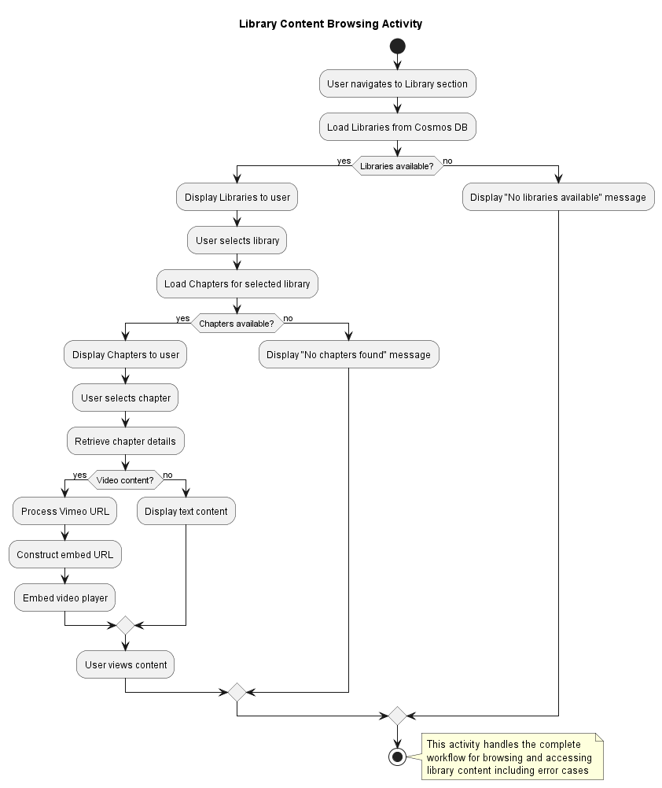
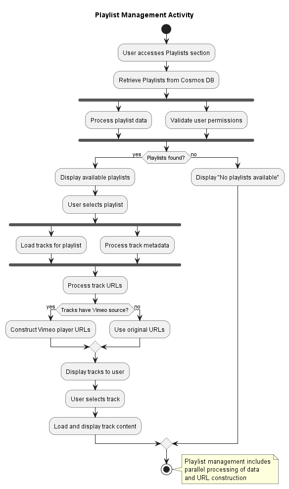
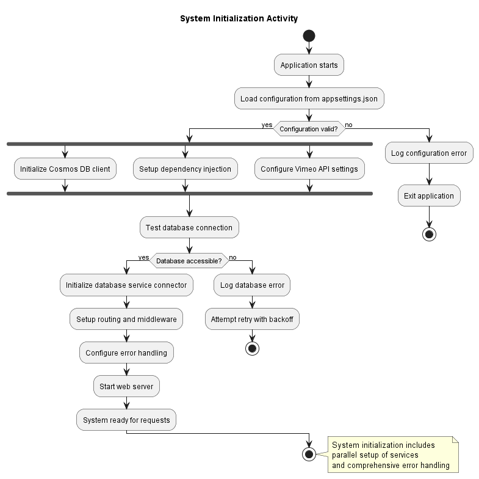
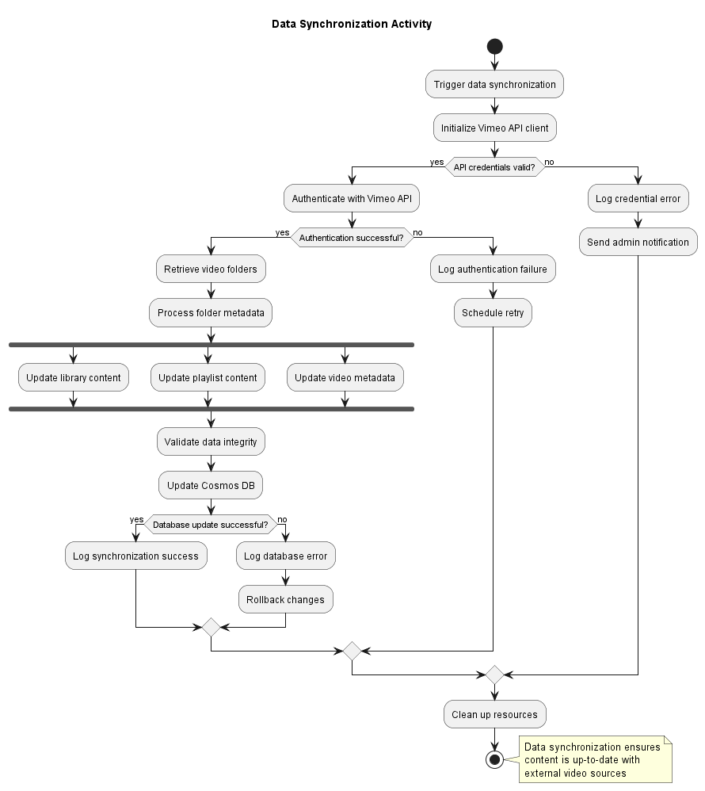

# System Activities - Aikido Live System

This document describes the main system activities and workflows using SysML activity diagrams with PlantUML notation.

## Activity Overview

The Aikido Live system performs several key activities to provide users with access to training content and manage the overall system functionality.

## AC-001: Library Content Browsing Activity

**Description**: This activity describes the complete workflow when a user browses library content.

**Preconditions**:
- System is operational
- Database connection is available
- Library content exists

**Activities**:
1. **Start**: User navigates to library section
2. **Load Libraries**: System retrieves available libraries from Cosmos DB
3. **Display Libraries**: System presents libraries to user
4. **Decision**: User selects a library
5. **Load Chapters**: System retrieves chapters for selected library
6. **Display Chapters**: System presents chapters to user
7. **Decision**: User selects a chapter
8. **Process Video URL**: System constructs Vimeo player URL
9. **Embed Video**: System embeds video player in page
10. **End**: User views content

**Exception Handling**:
- If database is unavailable, display error message
- If no content found, display appropriate message
- If video fails to load, show fallback content

## AC-002: Playlist Management Activity

**Description**: This activity describes the workflow for playlist management and track playback.

**Preconditions**:
- User has appropriate permissions
- Playlists exist in the system

**Activities**:
1. **Start**: User accesses playlists section
2. **Retrieve Playlists**: System queries Cosmos DB for playlists
3. **Process Playlist Data**: System processes playlist contents
4. **Display Playlists**: System shows available playlists
5. **Decision**: User selects playlist
6. **Load Tracks**: System retrieves tracks for selected playlist
7. **Process Track URLs**: System processes video URLs for tracks
8. **Display Tracks**: System presents tracks to user
9. **Decision**: User selects track
10. **Play Content**: System loads and plays selected content
11. **End**: User enjoys content

## AC-003: System Initialization Activity

**Description**: This activity describes the system startup and initialization process.

**Preconditions**:
- Configuration files are available
- Required services are accessible

**Activities**:
1. **Start**: Application starts
2. **Load Configuration**: System reads appsettings.json
3. **Initialize Services**: System sets up dependency injection
4. **Connect to Cosmos DB**: System establishes database connection
5. **Initialize Vimeo API**: System configures Vimeo API client
6. **Setup Routing**: System configures URL routing
7. **Decision**: All services initialized successfully?
8. **Start Web Server**: System starts listening for requests
9. **Ready**: System is ready to serve requests

**Exception Handling**:
- If configuration is invalid, log error and exit
- If database connection fails, retry with exponential backoff
- If critical services fail, prevent startup

## AC-004: Data Synchronization Activity

**Description**: This activity describes the process of synchronizing content data with external services.

**Preconditions**:
- System is running
- External APIs are accessible

**Activities**:
1. **Start**: Scheduled or triggered sync
2. **Connect to Vimeo API**: System authenticates with Vimeo
3. **Retrieve Video Metadata**: System fetches video information
4. **Process Metadata**: System processes and validates data
5. **Update Database**: System updates Cosmos DB with new data
6. **Decision**: More content to sync?
7. **Clean Up**: System performs cleanup operations
8. **End**: Synchronization complete

## Activity Control Flow

### Parallel Activities
- Content loading and UI rendering can occur in parallel
- Multiple user sessions are handled concurrently
- Database operations can be parallelized when possible

### Decision Points
- User authentication status affects content access
- Content availability determines display options
- System health affects operation modes

### Exception Handling
- All activities include error handling and logging
- Graceful degradation when external services are unavailable
- User-friendly error messages for all failure scenarios

## Performance Considerations

### Optimization Strategies
- Caching frequently accessed content
- Lazy loading of video content
- Asynchronous operations for better responsiveness
- Connection pooling for database operations

### Monitoring Points
- Response times for each activity
- Error rates and types
- Resource utilization
- User engagement metrics
