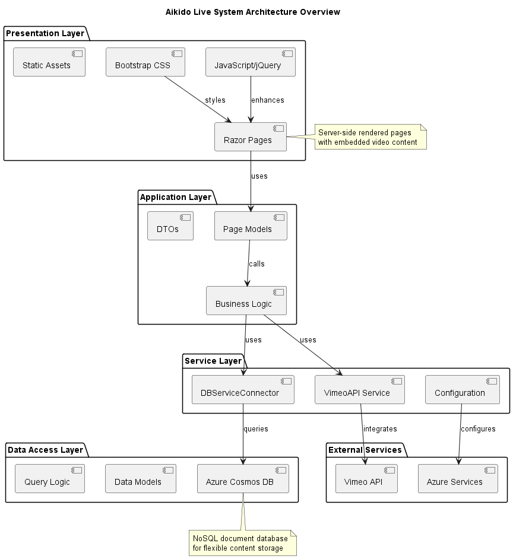
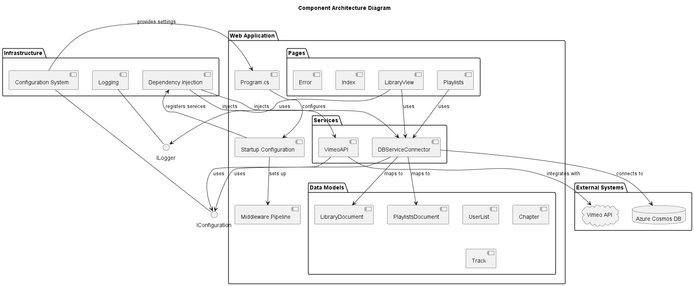
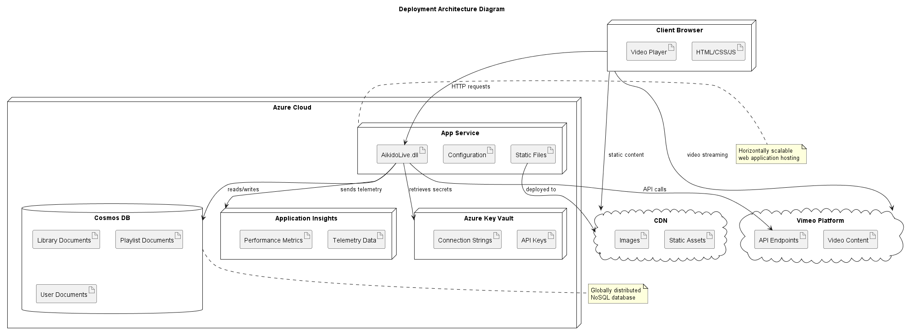
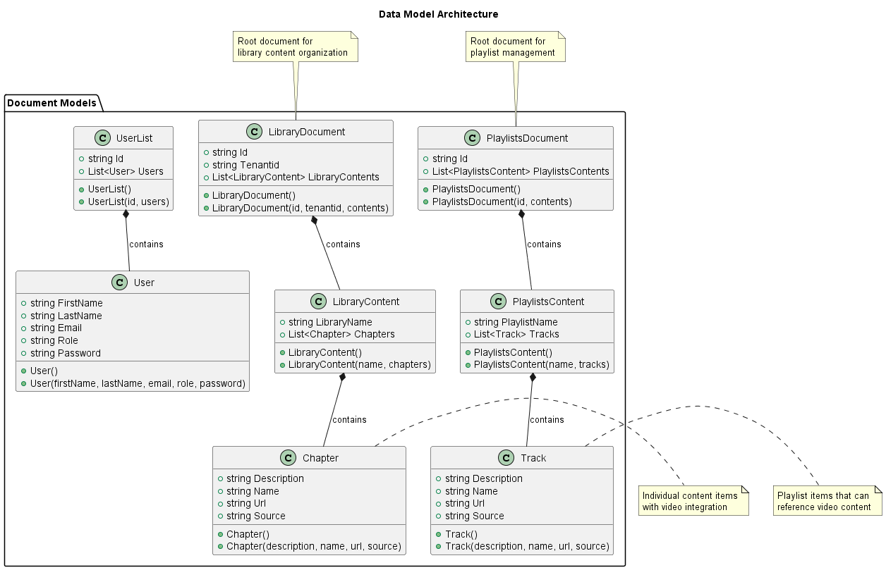
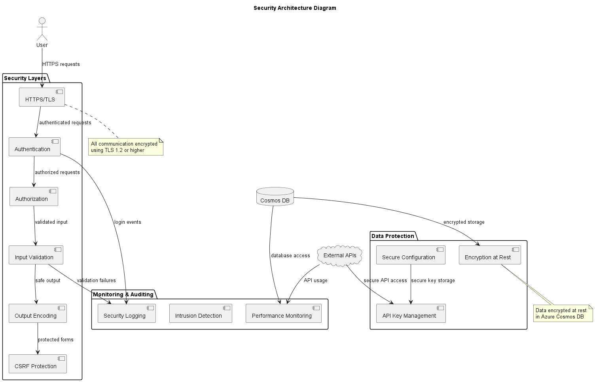

# System Architecture - Aikido Live System

This document describes the overall system architecture, component relationships, and design patterns using SysML notation.

## Architectural Overview

The Aikido Live system follows a layered architecture pattern with clear separation of concerns and modern web application best practices.



## Architecture Layers

### Presentation Layer
- **Razor Pages**: Server-side rendered web pages
- **JavaScript/jQuery**: Client-side interactivity
- **Bootstrap CSS**: Responsive UI framework
- **Static Assets**: Images, styles, and client-side scripts

### Application Layer
- **Page Models**: Handle HTTP requests and responses
- **Business Logic**: Application-specific rules and workflows
- **Data Transfer Objects**: Communication between layers

### Service Layer
- **DBServiceConnector**: Database abstraction service
- **VimeoAPI**: External API integration service
- **Configuration Services**: System configuration management

### Data Access Layer
- **Azure Cosmos DB**: NoSQL document database
- **Entity Models**: Data representation objects
- **Query Logic**: Database query operations

### External Services
- **Vimeo API**: Video content management
- **Azure Infrastructure**: Cloud hosting and services

## Component Architecture



### Core Components

#### Web Application Host
- **ASP.NET Core Runtime**: Web server and request processing
- **Dependency Injection**: Service lifecycle management
- **Configuration System**: Settings and environment management
- **Middleware Pipeline**: Request/response processing chain

#### Data Models
- **LibraryDocument**: Represents library content structure
- **PlaylistsDocument**: Represents playlist collections
- **UserList**: User management and authentication data
- **Chapter/Track**: Individual content items

#### Services
- **DBServiceConnector**: 
  - Cosmos DB client management
  - CRUD operations for all document types
  - Connection pooling and error handling
  
- **VimeoAPI**:
  - OAuth authentication flow
  - Video metadata retrieval
  - URL construction for embedded players

## Deployment Architecture



### Azure Cloud Infrastructure
- **App Service**: Hosts the web application
- **Cosmos DB**: Document database service
- **Application Insights**: Monitoring and diagnostics
- **Key Vault**: Secure configuration storage (recommended)

### External Dependencies
- **Vimeo Platform**: Video hosting and streaming
- **CDN**: Content delivery for static assets
- **DNS**: Domain name resolution

## Data Architecture



### Document Structure

#### Library Documents
```json
{
  "id": "library",
  "tenantid": "aikido-org",
  "libraryContents": [
    {
      "libraryName": "Lost Seminars",
      "chapters": [
        {
          "name": "Disk 1",
          "description": "Introduction to Aikido",
          "url": "887499743",
          "source": "vimeo"
        }
      ]
    }
  ]
}
```

#### Playlist Documents
```json
{
  "id": "playlists",
  "playlistsContents": [
    {
      "playlistName": "Beginner Series",
      "tracks": [
        {
          "name": "Basic Movements",
          "description": "Fundamental techniques",
          "url": "video-id",
          "source": "vimeo"
        }
      ]
    }
  ]
}
```

## Security Architecture



### Security Layers
- **Transport Security**: HTTPS/TLS encryption
- **Authentication**: User identity verification
- **Authorization**: Role-based access control
- **API Security**: Secure external service integration
- **Data Protection**: Encryption at rest and in transit

### Security Controls
- **Input Validation**: Server-side validation of all inputs
- **Output Encoding**: Prevention of XSS attacks
- **CSRF Protection**: Anti-forgery tokens
- **Secure Headers**: Security-related HTTP headers

## Performance Architecture

### Caching Strategy
- **Browser Caching**: Static assets cached client-side
- **Application Caching**: Frequently accessed data cached in memory
- **CDN Caching**: Global content distribution

### Optimization Techniques
- **Lazy Loading**: Content loaded on demand
- **Asynchronous Operations**: Non-blocking I/O operations
- **Connection Pooling**: Efficient database connections
- **Compression**: Response compression for faster transfer

## Scalability Considerations

### Horizontal Scaling
- **Stateless Design**: Application instances can be scaled horizontally
- **Load Balancing**: Traffic distribution across multiple instances
- **Database Scaling**: Cosmos DB automatic scaling capabilities

### Vertical Scaling
- **Resource Optimization**: CPU and memory efficient code
- **Database Performance**: Optimized queries and indexing
- **Caching**: Reduced database load through intelligent caching

## Quality Attributes

### Availability
- **Target**: 99.9% uptime
- **Redundancy**: Multiple application instances
- **Health Monitoring**: Automated health checks
- **Failover**: Automatic recovery mechanisms

### Performance
- **Response Time**: < 3 seconds for page loads
- **Throughput**: Support for 1000+ concurrent users
- **Scalability**: Linear scaling with resource addition

### Maintainability
- **Modular Design**: Clear separation of concerns
- **Documentation**: Comprehensive system documentation
- **Testing**: Automated testing strategies
- **Monitoring**: Application performance monitoring

### Security
- **Data Protection**: Encryption and secure storage
- **Access Control**: Role-based permissions
- **Audit Trail**: Comprehensive logging
- **Compliance**: Industry standard practices

## Technology Stack Summary

| Layer | Technology | Purpose |
|-------|------------|---------|
| Frontend | Razor Pages, jQuery, Bootstrap | User interface |
| Backend | ASP.NET Core 8.0 | Web application framework |
| Database | Azure Cosmos DB | Document storage |
| External API | Vimeo API | Video content |
| Hosting | Azure App Service | Cloud hosting |
| Monitoring | Application Insights | Performance monitoring |
