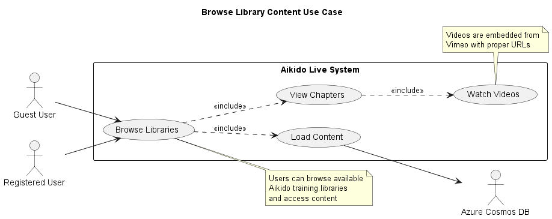
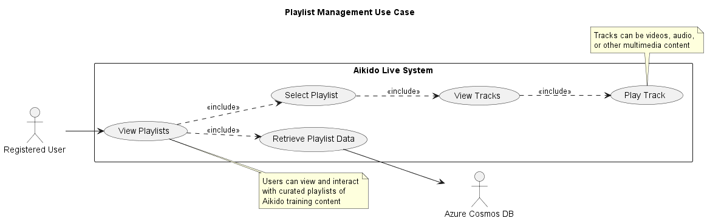
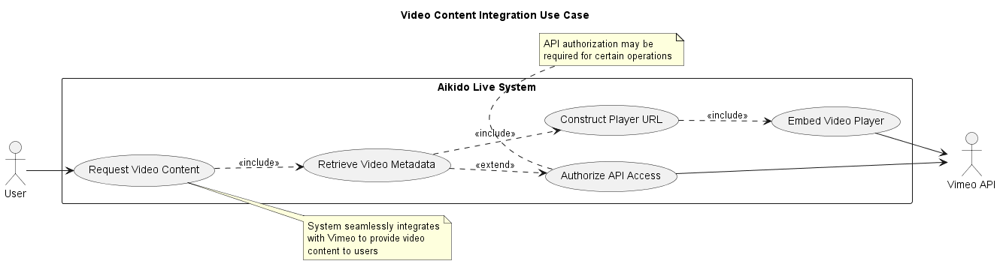
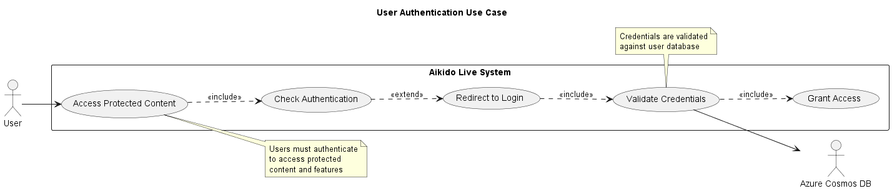
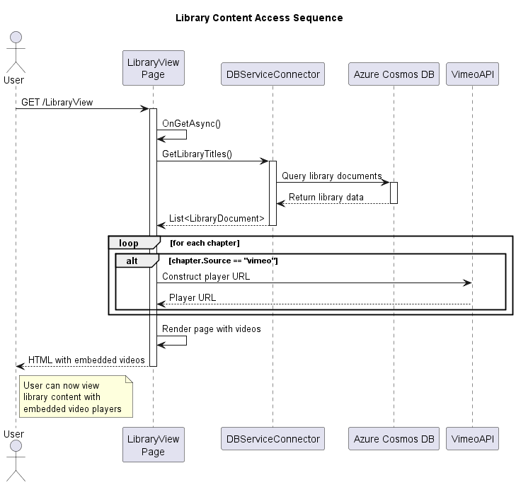
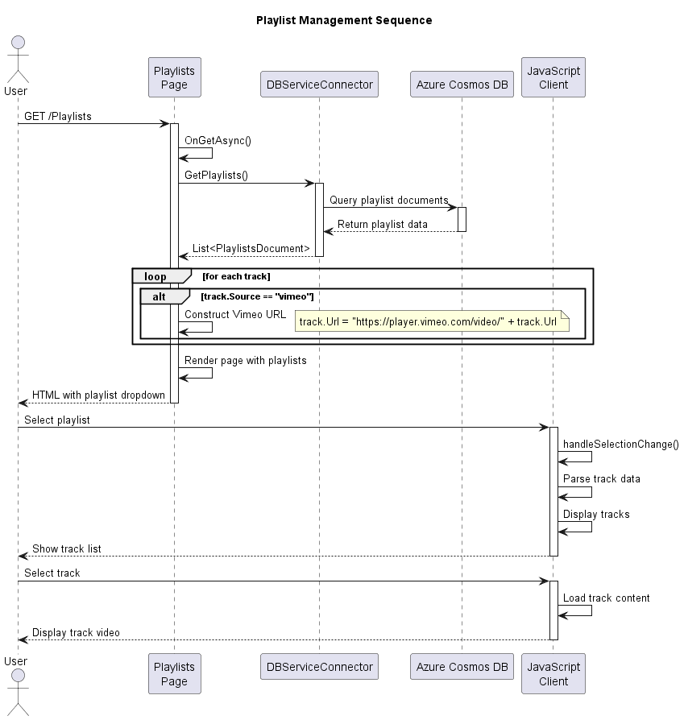
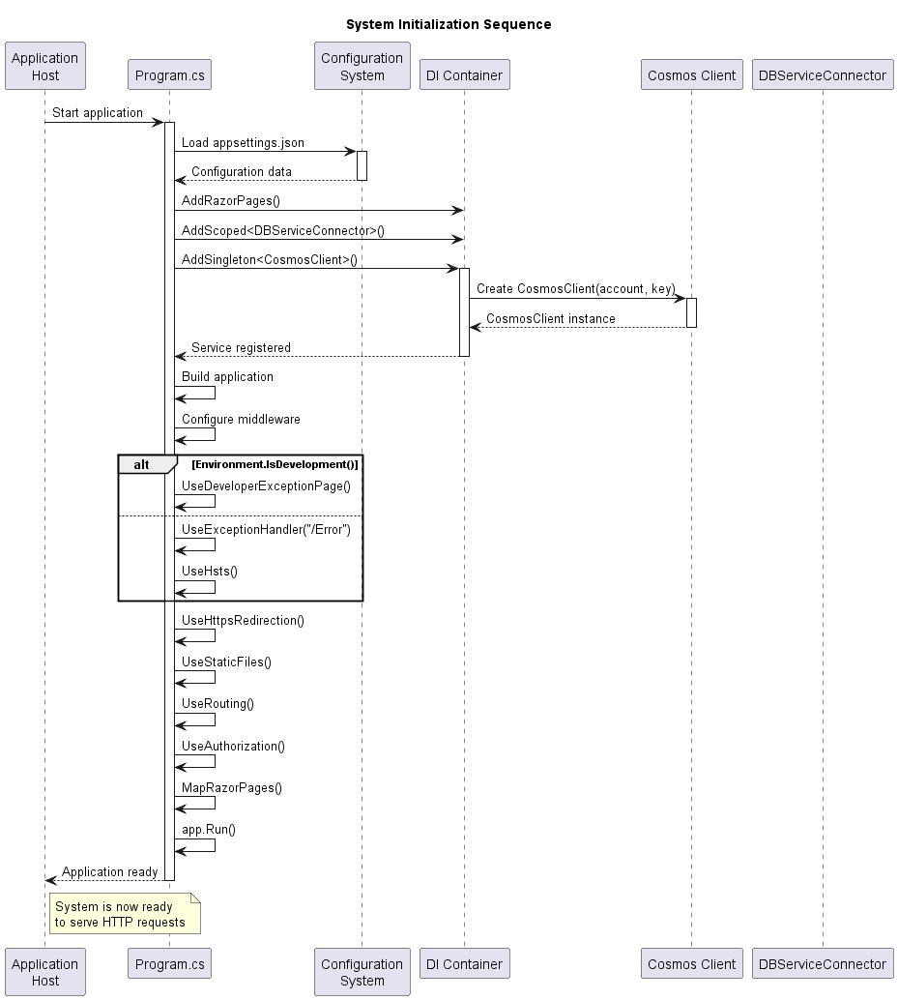
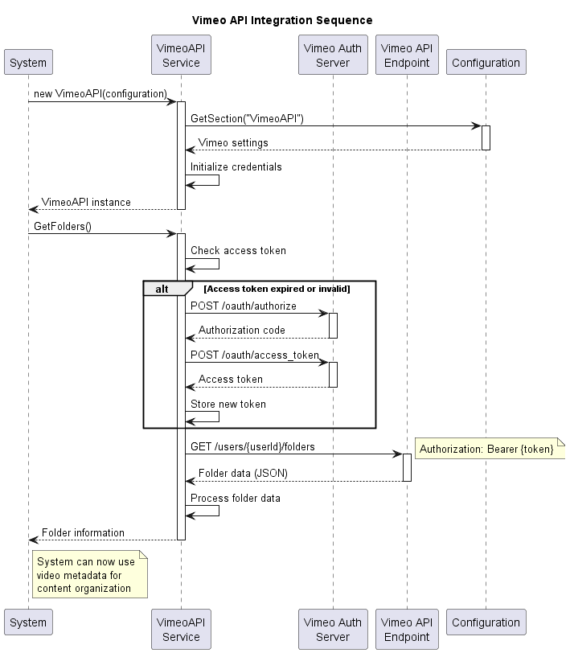
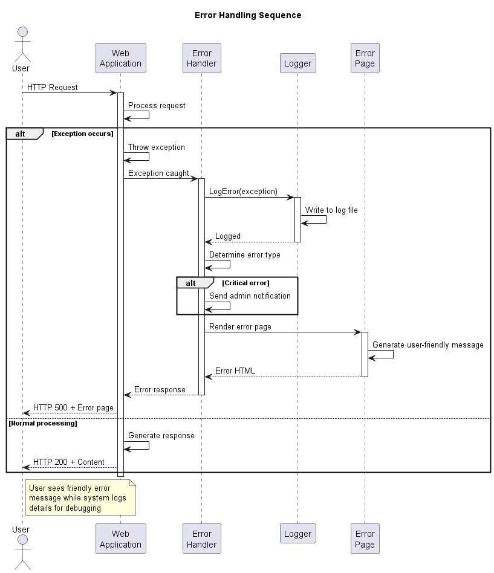

# Project Documentation Summary - Aikido Live System

## Documentation Overview

This document provides a comprehensive overview of the Aikido Live Interactive Library System documentation, created using SysML notation and PlantUML diagrams.

## Project Structure

The Aikido Live system is an ASP.NET Core 7.0 web application that provides an interactive digital library for Aikido practitioners. The system integrates with Azure Cosmos DB for data persistence and Vimeo API for video content management.

### Key Technologies
- **Backend**: ASP.NET Core 7.0, C#
- **Database**: Azure Cosmos DB (NoSQL)
- **Video Platform**: Vimeo API
- **Frontend**: Razor Pages, Bootstrap, jQuery
- **Cloud Platform**: Microsoft Azure

## Documentation Components

### 1. Use Cases Documentation
**File**: [use-cases.md](use-cases.md)

Describes the main system use cases with PlantUML diagrams:
- **UC-001**: Browse Library Content 
- **UC-002**: Manage Playlists 
- **UC-003**: Video Content Integration 
- **UC-004**: User Authentication 

**Key Actors**: Guest User, Registered User, Administrator, Vimeo System, Azure Cosmos DB

### 2. Activity Diagrams Documentation
**File**: [activities.md](activities.md)

Documents system workflows and activities:
- **AC-001**: Library Content Browsing Activity 
- **AC-002**: Playlist Management Activity 
- **AC-003**: System Initialization Activity 
- **AC-004**: Data Synchronization Activity 

**Focus Areas**: User workflows, system processes, error handling, parallel activities

### 3. Sequence Diagrams Documentation
**File**: [sequences.md](sequences.md)

Shows temporal interactions between system components:
- **SQ-001**: Library Content Access Sequence 
- **SQ-002**: Playlist Management Sequence 
- **SQ-003**: System Initialization Sequence 
- **SQ-004**: Vimeo API Integration Sequence 
- **SQ-005**: Error Handling Sequence 

**Key Patterns**: Async/await operations, error handling, external API integration

### 4. Architecture Documentation
**File**: [architecture.md](architecture.md)

Comprehensive system architecture overview:
- **System Overview**: 
- **Component Diagram**: 
- **Deployment Diagram**: 
- **Data Model**: 
- **Security Architecture**: 

**Architecture Layers**: Presentation, Application, Service, Data Access

## System Capabilities

### Core Features
1. **Library Management**
   - Browse Aikido training content
   - Organized by libraries and chapters
   - Video integration with Vimeo

2. **Playlist System**
   - Curated collections of content
   - Track-based organization
   - Dynamic content loading

3. **Video Integration**
   - Seamless Vimeo API integration
   - Embedded video players
   - URL construction and management

4. **User Management**
   - Authentication system
   - Role-based access control
   - User data management

### Technical Capabilities
1. **Data Management**
   - Azure Cosmos DB integration
   - Document-based data storage
   - Efficient querying and retrieval

2. **External API Integration**
   - Vimeo API authentication
   - Video metadata retrieval
   - Error handling and retry logic

3. **Web Application Features**
   - Responsive design
   - Server-side rendering
   - Client-side interactivity

## Quality Attributes

### Performance
- **Page Load Time**: < 3 seconds target
- **Database Queries**: < 2 seconds target
- **Video Start Time**: < 5 seconds target
- **Concurrent Users**: 1000+ support target

### Security
- **Transport Security**: HTTPS/TLS encryption
- **Authentication**: User identity verification
- **Authorization**: Role-based access control
- **Data Protection**: Encryption at rest and in transit

### Scalability
- **Horizontal Scaling**: Stateless application design
- **Database Scaling**: Cosmos DB auto-scaling
- **CDN Integration**: Global content distribution
- **Load Balancing**: Multi-instance deployment

### Reliability
- **Availability**: 99.9% target uptime
- **Error Handling**: Comprehensive exception management
- **Monitoring**: Application insights integration
- **Recovery**: Backup and disaster recovery procedures

## File Organization

### Documentation Structure
```
docs/
├── README.md                 # Main documentation entry point
├── use-cases.md             # Use case specifications
├── activities.md            # Activity flow documentation
├── sequences.md             # Sequence interaction diagrams
├── architecture.md          # Architecture overview
├── project-summary.md       # This comprehensive summary
└── diagrams/               # PlantUML source files
    ├── uc-*.puml           # Use case diagrams
    ├── ac-*.puml           # Activity diagrams
    ├── sq-*.puml           # Sequence diagrams
    └── arch-*.puml         # Architecture diagrams
└── images/                 # Generated PNG diagrams
    ├── uc-*.png           # Use case images
    ├── ac-*.png           # Activity images
    ├── sq-*.png           # Sequence images
    └── arch-*.png         # Architecture images
```

### Diagram Categories
1. **Use Case Diagrams** (uc-*.puml/png): System functionality from user perspective
2. **Activity Diagrams** (ac-*.puml/png): Workflow and process flows
3. **Sequence Diagrams** (sq-*.puml/png): Temporal interactions between components
4. **Architecture Diagrams** (arch-*.puml/png): System structure and deployment

## Implementation Guidance

### Development Workflow
1. **Setup**: Configure Azure Cosmos DB and Vimeo API credentials
2. **Development**: Use dependency injection for service management
3. **Testing**: Implement comprehensive testing strategy
4. **Deployment**: Deploy to Azure App Service with monitoring

### Configuration Management
- **Database**: Configure Cosmos DB connection strings
- **External APIs**: Secure Vimeo API credential storage
- **Environment**: Use environment-specific configuration
- **Security**: Implement Azure Key Vault for secrets

### Monitoring and Maintenance
- **Performance**: Monitor response times and resource usage
- **Errors**: Track exception rates and types
- **Usage**: Monitor user engagement and content access
- **Security**: Audit access patterns and security events

## Future Enhancements

### Planned Features
1. **Search Functionality**: Content search across libraries
2. **User Profiles**: Enhanced user management features
3. **Content Management**: Admin tools for content curation
4. **Mobile App**: Native mobile application development

### Technical Improvements
1. **Caching**: Implement Redis for improved performance
2. **API Gateway**: Centralized API management
3. **Microservices**: Decompose into microservice architecture
4. **Real-time Features**: SignalR integration for real-time updates

## Conclusion

The Aikido Live system documentation provides a comprehensive view of the system architecture, functionality, and implementation details. The combination of SysML notation and PlantUML diagrams offers clear visualization of system behavior, structure, and interactions.

This documentation serves as a foundation for:
- **Development Teams**: Understanding system architecture and implementation
- **Stakeholders**: Visualizing system capabilities and features
- **Operations Teams**: Deployment and maintenance guidance
- **Quality Assurance**: Testing scenarios and acceptance criteria

The modular documentation approach ensures maintainability and allows for incremental updates as the system evolves.

---

**Documentation Generated**: May 25, 2025  
**System Version**: Aikido Live v1.0  
**Framework**: ASP.NET Core 7.0  
**Database**: Azure Cosmos DB  
**External APIs**: Vimeo API v3.4
